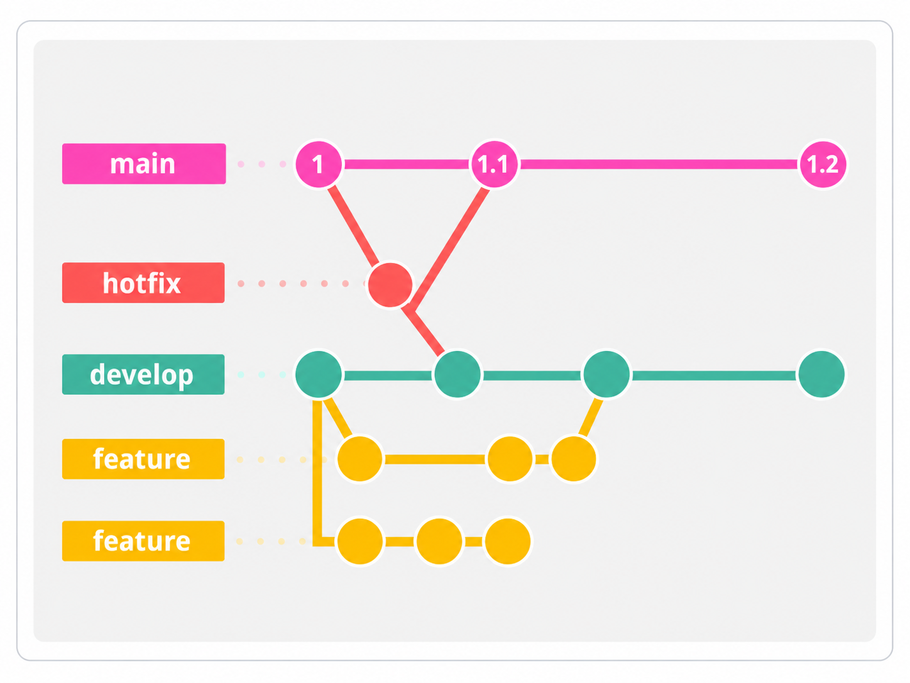
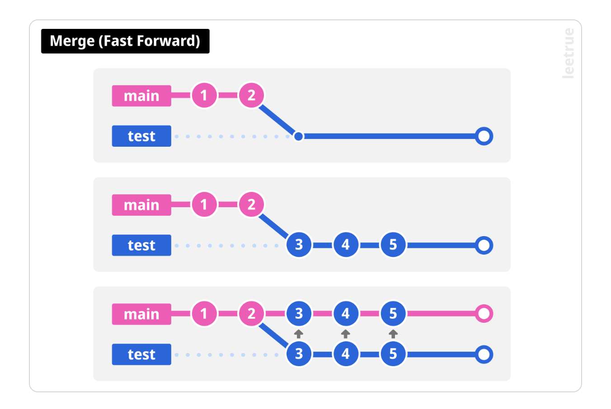
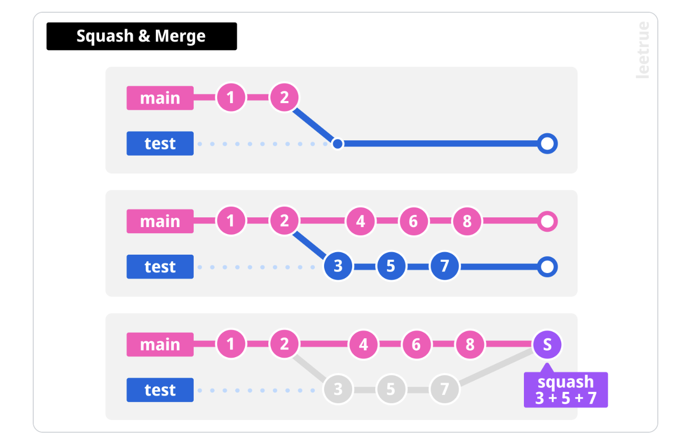
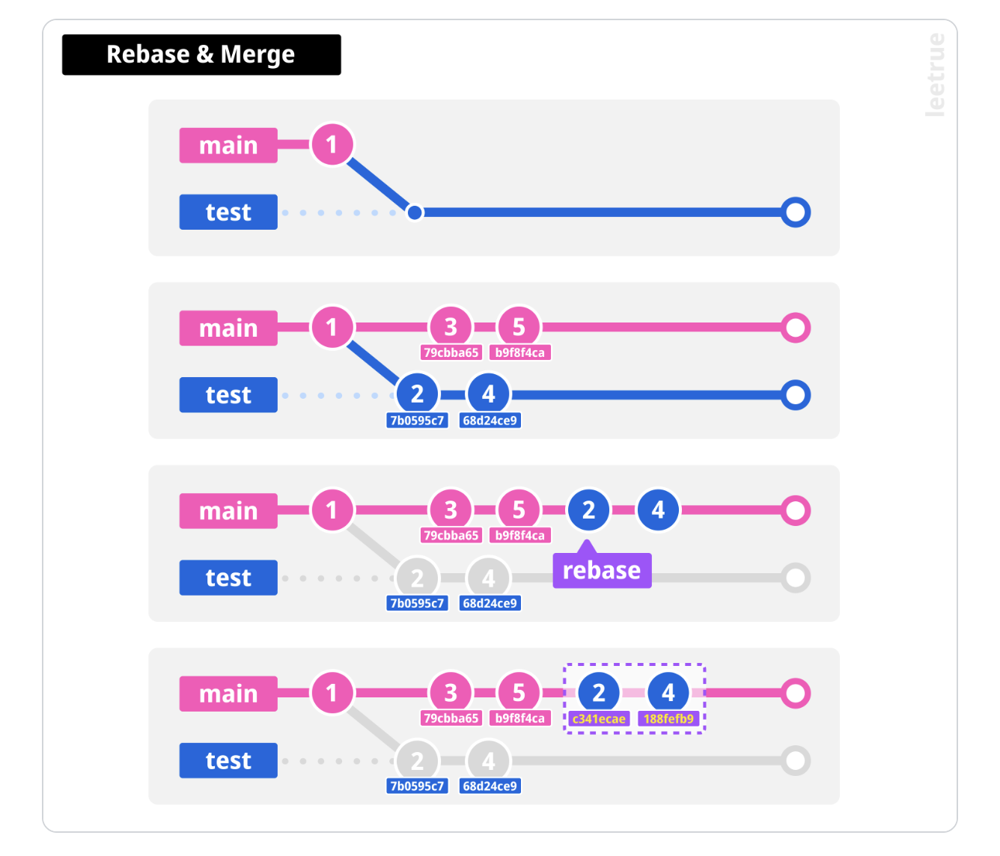

# Contributing Guide

이 문서는 프로젝트 개발 진행 시 지켜야 할 이슈 발행, 브랜치 전략, 커밋 메시지 컨벤션, Pull Request(PR) 규칙을 정의합니다.

## 1. 기본 원칙

- 모든 작업은 GitHub Issue를 먼저 생성한 후 시작합니다.
- 하나의 이슈는 하나의 작업 브랜치에서 처리합니다.
- `main`과 `develop` 브랜치에는 직접 push하지 않습니다.
- 모든 변경 사항은 PR과 코드 리뷰를 거쳐 병합합니다.
- 하나의 PR에는 하나의 목적에 해당하는 변경만 포함합니다.

## 2. GitHub Issue 규칙

### 이슈 생성

- 작업을 시작하기 전에 [작업 이슈 템플릿](.github/ISSUE_TEMPLATE/task.md)을 사용해 이슈를 생성합니다.
- 이슈 본문은 템플릿의 요약, 작업 범위, 완료 조건, 제외 범위 항목을 채웁니다.
- 이슈 제목은 커밋 메시지와 동일하게 `<type>: <title>` 형식으로 작성합니다.
  - `type`은 커밋 메시지에서 사용하는 type과 동일하게 작성합니다.
  - `title`은 영어 소문자로 작성합니다. 다만 Spark, Kafka와 같은 고유 명사는 첫 글자 대문자를 허용합니다.

예시:

```text
feat: add tlc data ingestion pipeline
fix: prevent duplicate segment records
docs: add Kafka producer troubleshooting guide
```

### 이슈 발행 시 권장 사항

- 라벨을 추가해 작업 유형이나 우선순위를 표시합니다.
- 작업자를 지정해 담당자를 명확히 합니다.
- 관련된 다른 이슈나 PR이 있다면 본문에서 참조합니다.
- 완료 조건은 리뷰어나 다른 팀원이 봐도 작업 완료 여부를 판단할 수 있을 만큼 구체적으로 작성합니다.

## 3. 브랜치 전략



`main`, `develop`, `hotfix`, 작업 브랜치가 어떻게 분기되고 병합되는지를 나타낸 다이어그램입니다.

### 브랜치 역할

| 브랜치 | 역할 | 분기 기준 | 병합 대상 |
| --- | --- | --- | --- |
| `main` | 배포 가능한 안정 버전을 관리합니다. | - | - |
| `develop` | 다음 배포를 위한 변경 사항을 통합합니다. | `main` | `main` |
| 작업 브랜치 | 이슈 단위 작업을 수행합니다. | `develop` | `develop` |
| `hotfix/*` | 운영 환경의 긴급 문제를 수정합니다. | `main` | `main`, 이후 `develop`에 반영 |

### 작업 브랜치 이름

작업 브랜치는 다음 형식으로 작성합니다.

```text
<type>/<issue-number>-<short-description>
```

- `type`은 커밋 메시지에서 사용하는 type과 동일하게 작성합니다.
- `issue-number`에는 GitHub Issue 번호를 작성합니다.
- `short-description`은 작업 내용을 나타내는 짧은 영문 kebab-case로 작성합니다.

예시:

```text
feat/12-add-tlc-ingestion
fix/18-prevent-duplicate-records
refactor/23-optimize-spark-join
test/27-add-data-quality-check
docs/31-write-data-contract
```

### 작업 흐름

1. 작업할 GitHub Issue를 생성하거나 할당받습니다.
2. 최신 `develop` 브랜치에서 작업 브랜치를 생성합니다.
3. 작업 내용을 커밋하고 원격 저장소에 push합니다.
4. 작업 브랜치에서 `develop`을 대상으로 PR을 생성합니다.
5. CI, 리뷰 및 필수 검증을 통과한 후 Squash merge합니다.
6. 병합한 사람이 작업 브랜치를 삭제합니다.

```bash
git switch develop
git pull origin develop
git switch -c feat/12-add-tlc-ingestion
```

### Hotfix 흐름

운영 환경의 긴급 수정이 필요한 경우에만 사용합니다.

1. `main`에서 `hotfix/<issue-number>-<short-description>` 브랜치를 생성합니다.
2. 수정 후 `main`을 대상으로 PR을 생성합니다.
3. 리뷰와 검증을 거쳐 Squash merge합니다.
4. 수정 사항을 `develop`에도 즉시 반영합니다.

## 4. 커밋 메시지 컨벤션

### 기본 형식

커밋 메시지는 scope 없이 다음 형식으로 작성합니다.

```text
<type>: <subject>

<body>

<footer>
```

`body`와 `footer`는 필요한 경우에만 작성합니다.

### Type

| Type | 설명 |
| --- | --- |
| `feat` | 새로운 기능이나 데이터 파이프라인을 추가합니다. |
| `fix` | 버그 또는 잘못된 데이터 처리 로직을 수정합니다. |
| `docs` | 문서만 변경합니다. |
| `style` | 코드 동작에 영향을 주지 않는 포맷을 변경합니다. |
| `refactor` | 기능 변경 없이 코드 구조를 개선합니다. |
| `perf` | 실행 속도, 메모리, 쿼리 등 성능을 개선합니다. |
| `test` | 테스트 또는 데이터 품질 검증을 추가·수정합니다. |
| `build` | 빌드 시스템이나 외부 의존성을 변경합니다. |
| `ci` | CI/CD 설정과 스크립트를 변경합니다. |
| `chore` | 그 밖의 유지보수 작업을 수행합니다. |
| `revert` | 이전 커밋을 되돌립니다. |

### Subject

- 변경 내용을 명확하고 간결하게 작성합니다.
- 영어 소문자로 작성합니다.
- 명령형 현재 시제를 사용합니다. 과거형이나 3인칭 단수형 대신 `add`, `change`, `fix`와 같은 동사 원형으로 시작합니다.
- 50자 이내 작성을 권장합니다.
- 문장 끝에 마침표를 사용하지 않습니다.
- 하나의 커밋에는 하나의 논리적 변경만 포함합니다.

예시:

```text
feat: add tlc data ingestion pipeline
fix: prevent duplicate segment records
test: validate ride comfort score range
docs: add data contract guide
```

### Body

- 변경한 내용과 함께 변경한 이유를 설명합니다.
- 필요한 경우 기존 동작과 변경 후 동작의 차이를 설명합니다.
- 약 72자를 기준으로 줄바꿈합니다.

```text
fix: prevent duplicate segment records

파이프라인 재실행 시 동일 데이터가 중복되지 않도록
trip_id와 segment_id를 기준으로 멱등성을 보장한다.
```

### Footer

관련 이슈를 참조할 때 다음 형식을 사용합니다.

```text
Refs #12
Closes #18
```

- `Refs`는 관련 이슈를 참조할 때 사용합니다.
- `Closes`는 변경 사항이 기본 브랜치에 반영될 때 종료할 이슈에 사용합니다.
- 하위 호환성이 깨지는 변경은 `BREAKING CHANGE:`로 시작하여 영향과 마이그레이션 방법을 작성합니다.

```text
BREAKING CHANGE: 승차감 점수의 범위를 1~10에서 0~1로 변경한다.

기존 데이터를 사용하는 작업은 점수를 10으로 나누어 변환해야 한다.
```

### Revert

이전 커밋을 되돌릴 때는 되돌릴 커밋 제목을 작성하고, 본문에 커밋 해시를 명시합니다.

- Revert를 진행하기 전에 대상 커밋과 영향 범위를 팀원에게 고지합니다.
- 긴급한 장애 대응으로 사전 고지가 어려운 경우에는 Revert 직후 변경 내용과 사유를 팀원에게 공유합니다.

```text
revert: add tlc data ingestion pipeline

This reverts commit <commit-hash>.
```

## 5. Pull Request 규칙

### PR 생성

- 작업 브랜치의 PR 대상은 원칙적으로 `develop`입니다.
- PR 제목은 커밋 메시지와 동일하게 `<type>: <subject>` 형식으로 작성합니다.
- 제목은 영어 소문자 명령문으로 명확하고 간결하게 작성합니다.
- 아직 리뷰할 준비가 되지 않았다면 Draft PR로 생성합니다.
- PR 본문에 연관된 이슈와 작업 내용을 작성합니다.
- PR 본문의 마지막 줄에는 `Closes #이슈번호`를 작성합니다.
- 리뷰 가능한 크기로 유지하고 서로 다른 목적의 변경은 PR을 분리합니다.
- 변경 라인(추가+삭제)은 500줄을 넘지 않도록 하고, 초과할 경우 PR을 여러 개로 분리합니다.

PR 제목 예시:

```text
feat: add tlc data ingestion pipeline
```

### PR 본문 필수 내용

PR에는 최소한 다음 내용을 포함합니다.

1. 체크리스트 형식의 작업 내용
2. 본문 마지막 줄에 `Closes #이슈번호`

리뷰 요구사항과 참고 사항은 필요한 경우에만 작성합니다.

`develop`이 기본 브랜치가 아니라면 PR을 `develop`에 병합해도 GitHub Issue가 자동으로 종료되지 않을 수 있습니다. 이 경우 PR 병합 후 이슈 상태를 확인하고 수동으로 종료합니다.

### 리뷰 및 병합 조건

다음 조건을 모두 만족한 후 병합합니다.

- 최소 1명 이상의 승인을 받았습니다.
- 리뷰 의견과 대화가 모두 해결되었습니다.
- CI와 필수 테스트가 통과했습니다.
- 충돌이 없고 최신 `develop`의 변경 사항을 반영했습니다.
- 작성자는 자신의 PR을 직접 승인하지 않습니다.

## 6. Merge 전략

각 병합 방식에 대한 자세한 설명은 문서 가장 아래의 [Merge 전략 가이드](#merge-전략-가이드) 부록을 참고합니다.

### 병합 방식

- 작업 브랜치에서 `develop`으로 병합할 때는 **Squash merge**를 사용합니다.
- Squash merge 시 최종 커밋 제목은 `<type>: <subject>` 형식의 커밋 컨벤션에 맞게 수정합니다.
- 배포 또는 릴리스 시 `develop`에서 `main`으로 병합할 때는 **Merge commit**을 사용합니다.
- `main`은 항상 배포 가능한 상태를 유지합니다.

### 충돌 해결 가이드

머지 충돌은 두 브랜치가 동일하거나 인접한 코드를 다르게 수정했거나, 한 브랜치가 수정한 파일을 다른 브랜치가 삭제하는 등 Git이 변경 사항을 자동으로 합칠 수 없을 때 발생합니다.

#### 충돌 해결 원칙

1. **소통을 우선합니다.**
   - 충돌한 코드를 임의로 삭제하거나 덮어쓰기 전에 해당 코드를 수정한 팀원과 변경 의도를 확인합니다.
   - 어떤 변경을 유지해야 할지 불분명하면 혼자 판단하지 않고 두 작업자가 함께 결정합니다.
2. **나중에 병합하는 PR 작성자가 해결을 주도합니다.**
   - 먼저 병합된 `develop`의 변경 사항을 기준으로 합니다.
   - 나중에 병합하는 PR 작성자가 최신 `develop`을 자신의 작업 브랜치에 반영하고 충돌을 해결합니다.
3. **충돌 마커를 모두 제거합니다.**
   - 해결 후 `<<<<<<<`, `=======`, `>>>>>>>` 마커가 남아 있지 않은지 확인합니다.
   - 마커만 삭제하는 것이 아니라 양쪽 변경 의도가 모두 올바르게 반영되었는지 확인합니다.
4. **해결 후 다시 검증합니다.**
   - 충돌한 파일뿐 아니라 해당 변경의 영향을 받는 테스트와 파이프라인도 다시 검증합니다.
   - 충돌 해결로 주요 로직이 변경되었다면 기존 리뷰어에게 재검토를 요청합니다.

#### 충돌 마커 구조

```text
<<<<<<< HEAD
현재 작업 브랜치의 내용
=======
병합하려는 브랜치의 내용
>>>>>>> origin/develop
```

`HEAD`는 현재 체크아웃한 작업 브랜치, 아래쪽은 현재 브랜치로 병합하려는 브랜치의 변경 사항을 의미합니다.

#### 에디터 선택 옵션

| 옵션 | 의미 | 사용 기준 |
| :--- | :--- | :--- |
| **Accept Current** | 현재 작업 브랜치의 내용을 유지합니다. | 현재 변경만 유지하는 것이 맞다고 두 작업자가 확인한 경우 |
| **Accept Incoming** | 병합하려는 브랜치의 내용을 유지합니다. | `develop`의 변경만 유지하는 것이 맞다고 확인한 경우 |
| **Accept Both** | 양쪽 내용을 모두 남깁니다. | 두 변경이 모두 필요하며, 선택 후 직접 코드를 정리하고 검증할 경우 |
| **직접 수정 (Manual Resolution)** | 충돌 마커와 불필요한 코드를 직접 지우고 필요한 코드를 수정합니다. | 양쪽 코드의 일부만 필요하거나 로직을 직접 조합·재작성해야 하는 경우 |

충돌 해결 후 중복 코드, 실행 순서, 문법 오류를 확인합니다.

#### 표준 해결 절차

1. 충돌한 파일을 확인합니다.

   ```bash
   git status
   ```

2. 관련 작업자와 변경 의도를 확인한 후 파일을 수정하고 충돌 마커를 제거합니다.
3. 해결한 파일을 스테이징하고 실제 변경 내용을 검토합니다.

   ```bash
   git add <해결한-파일>
   git diff --cached
   ```

4. 프로젝트 테스트와 필요한 데이터 검증을 수행한 후 커밋합니다.

   ```bash
   git commit -m "chore: resolve merge conflicts"
   git push origin <작업-브랜치>
   ```

5. PR에서 CI 결과를 확인하고 기존 리뷰어에게 재검토를 요청합니다.

충돌 해결을 처음부터 다시 진행해야 한다면 커밋하기 전에 다음 명령으로 병합을 취소합니다.

```bash
git merge --abort
```

## 7. 브랜치 보호 및 금지 사항

### 브랜치 보호 규칙

`main`과 `develop` 브랜치에 다음 규칙을 적용합니다.

- 직접 push하지 않고 반드시 PR을 통해 변경합니다.
- 최소 1명 이상의 팀원에게 승인을 받은 후 병합합니다.
- 리뷰 의견과 대화를 모두 해결한 후 병합합니다.
- CI와 필수 테스트를 통과한 후 병합합니다.
- 해당 브랜치 삭제는 허용하지 않습니다.

### 작업 시 금지 사항

- Force push를 허용하지 않습니다.
- 다른 팀원이 함께 사용하는 브랜치를 임의로 rebase하지 않습니다.
- 충돌 내용을 확인하지 않고 `ours` 또는 `theirs`의 변경 사항을 일괄 적용하지 않습니다.
- 리뷰와 필수 검증을 생략하고 병합하지 않습니다.
- 서로 관련 없는 여러 이슈를 하나의 PR에 포함하지 않습니다.

---

<a id="merge-전략-가이드"></a>

<details>
<summary>Merge 전략 가이드</summary>

브랜치를 병합하는 방법에는 여러 가지가 있습니다. 아래 내용을 참고하면 [6. Merge 전략](#6-merge-전략)에서 병합 지점마다 왜 그 방식을 선택했는지 이해할 수 있습니다.

## Fast-Forward Merge



브랜치를 나눈 뒤 base 브랜치에 아무 변경이 없었다면, 병합 커밋 없이 작업 브랜치의 커밋들이 그대로 base 브랜치 뒤에 이어붙습니다.

```bash
git checkout main
git merge feature/branch
```

- 히스토리가 하나의 직선으로 깔끔하게 유지됩니다.
- 병합 커밋이 없어서 어떤 브랜치가 언제 합쳐졌는지 구분하기 어렵습니다.

## Merge Commit (3-way / Recursive Merge)

base 브랜치와 작업 브랜치 양쪽에 각각 변경이 있으면, 두 브랜치의 변경 사항을 합치는 병합 커밋이 새로 생성됩니다. Fast-Forward가 가능한 상황에서도 `--no-ff` 옵션을 주면 병합 커밋을 강제로 만들 수 있습니다.

```bash
git checkout main
git merge feature/branch
```

- 모든 커밋 이력이 그대로 보존되어 어떤 브랜치가 언제 병합됐는지 추적할 수 있습니다.
- 병합이 반복될수록 그래프가 복잡해져 가독성이 떨어질 수 있습니다.
- **우리 프로젝트에서는 `develop`에서 `main`으로 병합할 때 이 방식을 사용합니다.** 배포 시점마다 어떤 변경이 반영됐는지 이력을 명확히 남기기 위함입니다.

## Squash & Merge



작업 브랜치의 모든 커밋을 하나로 합쳐, base 브랜치에 새 커밋 1개로 추가하는 방식입니다.

```bash
git checkout main
git merge --squash feature/branch
git commit -m "squash & merge"
```

- base 브랜치의 히스토리가 이슈 단위로 깔끔하게 정리됩니다.
- 작업 브랜치에 쌓여 있던 개별 커밋 이력은 병합 후 사라집니다.
- **우리 프로젝트에서는 작업 브랜치에서 `develop`으로 병합할 때 이 방식을 사용합니다.** 이슈 하나당 `develop`에는 정리된 커밋 1개만 남기기 위함입니다.

## Rebase & Merge



작업 브랜치의 base를 최신 base 브랜치 위로 옮기고, 그 뒤에 커밋들을 다시 쌓는 방식입니다. base가 바뀌면서 커밋 해시도 새로 생성됩니다.

```bash
git checkout feature/branch
git rebase main
```

- 병합 커밋 없이 히스토리를 하나의 직선으로 유지할 수 있습니다.
- 이미 원격에 push한 커밋을 rebase하면 커밋 해시가 바뀌어 강제 push(Force Push)가 필요해지고, 같은 브랜치를 쓰는 팀원의 이력과 충돌할 위험이 큽니다.
- **우리 프로젝트에서는 이 방식을 사용하지 않습니다.** [Force Push 금지](#7-브랜치-보호-및-금지-사항) 원칙과 상충하기 때문입니다.

> 참고: [Merge 전략 정리 (leetrue.hashnode.dev)](https://leetrue.hashnode.dev/branch-merge-strategy)

</details>
