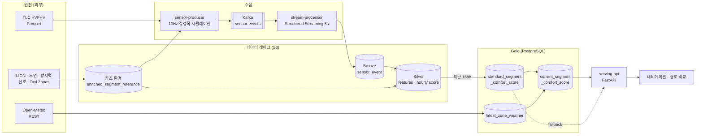

# Road Comfort Score

> **도로 구간 × 차량 타입별 승차감 점수를 생성·서빙하는 End-to-End 데이터 파이프라인**
>
> 소프티어 부트캠프 8기 Data Engineering 트랙 4팀(4una)

<div align="center">


</div>

---

## 한눈에 보기

|  | 내용 |
| --- | --- |
| **문제** | 경로 추천 알고리즘이 참조할 **세그먼트별 승차감 표준 데이터셋이 없다** |
| **해결** | 주행 센서 데이터를 수집·정제해 도로 구간 × 차량 프로필 단위의 **Comfort Score(0~100)** 를 시간 단위로 산출하고 API로 제공 |
| **산출물** | 날씨 미반영 **Standard Score**(최근 168시간 기준) + 날씨 반영 **Current Score**(현재 상태) |
| **소비자** | 내비게이션 경로 추천 시스템 개발자 |

**측정된 처리 규모** — Bronze 1시간 분량 기준 (`data/mzlake`, Spark 튜닝 기준 데이터셋)

| 계층 | 규모 | 압축률 |
| --- | --- | --- |
| Bronze `sensor_event` | **12,058,018 행** / 2.6 GB / 3,545 파일 | — |
| Silver `hourly_segment_features` | 38,049 행 | 317 : 1 |
| Silver `hourly_comfort_score` | 38,049 행 | — |
| 참조 세그먼트 | 73,579 개 | — |

> 10Hz 센서 원시 데이터를 시간 × 세그먼트 × 차량 프로필 그레인으로 **317:1** 축약하는 것이 이 파이프라인의 본질입니다.
> Bronze 한 시간이 3,545개 소파일로 쌓이는 문제는 별도 compaction DAG로 처리합니다 ([ADR-0009](docs/adr/0009-bronze-compaction-dag.md)).

---

## 목차

1. [문제와 가치](#1-문제와-가치)
2. [데이터](#2-데이터)
3. [아키텍처](#3-아키텍처)
4. [스테이지별 Input / Output](#4-스테이지별-input--output)
5. [승차감 점수 모델](#5-승차감-점수-모델)
6. [데이터 품질과 신뢰성](#6-데이터-품질과-신뢰성)
7. [서빙 API](#7-서빙-api)
8. [운영과 관측](#8-운영과-관측)
9. [설계 결정 기록(ADR)](#9-설계-결정-기록adr)
10. [로컬 실행](#10-로컬-실행)
11. [저장소 구조](#11-저장소-구조)
12. [팀원 소개](#12-팀원-소개)

---

## 1. 문제와 가치

| 구분 | 내용 |
| --- | --- |
| **누구의 문제?** | 현대자동차의 내비게이션 경로 추천 시스템 개발자 |
| **어떤 문제?** | 경로 알고리즘 개발 시 필요한, 세그먼트별 승차감(Ride Comfort)을 나타내는 표준 데이터셋이 없음 |
| **핵심 지표** | 승차감 반영 경로의 선택률 |

> 승차감 민감 승객(임산부, 노약자, 유아 동반 등)이 탑승한 주행을 집계한 결과, 최단 경로가 아닌 **편안한 경로**를 선택한 비율이 **70%** 를 차지합니다.

### 이 프로젝트가 만드는 것

경로 추천 시스템이 **후보 경로를 승차감으로 비교**할 수 있으려면, 경로를 구성하는 개별 도로 구간마다 점수가 있어야 합니다. 이 프로젝트는 그 점수를 다음 계약으로 제공합니다.

- **그레인** — 도로 세그먼트(LION `SegmentID`) × 차량 프로필
- **값** — `comfort_score` 0~100, 방향별(수직·종·횡) 점수, `confidence_score`
- **두 가지 버전** — 날씨를 반영하지 않은 **Standard**(재현 가능한 기준값)와, 현재 날씨를 반영한 **Current**(서빙용)
- **추적성** — 모든 점수에 산출 시각·데이터 기간·산식 버전이 함께 기록됨

### 왜 두 개로 나눴는가

날씨는 15분마다 바뀌지만 주행 이력은 시간 단위로만 늘어납니다. 둘을 한 테이블에 섞으면 날씨가 바뀔 때마다 168시간 재집계를 다시 해야 합니다.
**무거운 집계(Standard)와 가벼운 보정(Current)을 분리**해서, 날씨 변화 시에는 보정만 다시 계산합니다.

---

## 2. 데이터

### 2.1 데이터셋과 특성

| 데이터셋 | 역할 | 포맷 | 갱신 | 그레인 | 다뤄야 할 특성 |
| --- | --- | --- | --- | --- | --- |
| **NYC TLC HVFHV Trip Records** <br>*(Main)* | 주행 시뮬레이션 입력 | Parquet (월 단위) | 월 1회 고정 스냅샷 | 완료된 운행 1건 | 월 파일 전체가 아니라 **재생 대상 일자 + 필요 컬럼만** Arrow predicate로 읽어야 메모리가 견딤. 안정적 행 식별자가 없어 물리적 row-number를 타이브레이커로 사용 |
| **NYC LION** | 도로 위상·**canonical SegmentID** | GeoJSON | 월 1회 (릴리스 26B) | street segment 1건 | `SegmentID`가 전 계층의 조인 키. 방향성·연결성 규칙과 릴리스 간 식별자 버전이 관리 대상 |
| **Street Pavement Ratings** | 노면 상태 | GeoJSON | 월 1회 | 노면 조사 구간 1건 | 원천 구간이 LION 세그먼트와 1:1이 아니라 **공간 조인 + 정규화된 도로명 매칭**이 필요 |
| **Speed Humps** | 과속방지턱 | GeoJSON | 월 1회 | 방지턱 설치 지점 1건 | 교차로 인접 중복 레코드 처리 필요 |
| **OSM Traffic Signals** | 신호등 | GeoJSON | 월 1회 | 신호 노드 1건 | 세그먼트 경계 근처 신호의 귀속 판단 |
| **TLC Taxi Zones** | 승·하차 공간 제약 | Shapefile (ZIP) | 월 1회 | LocationID별 geometry 1건 | 도로가 없는 존(예: 264/265) 예외 처리 |
| **Open-Meteo** <br>*(Sub)* | 존별 날씨 | REST JSON | **15분** | 존 × 시각 | WMO weather code를 점수 보정용 상태로 정규화. API 장애·stale 대응 필요 |

### 2.2 왜 센서 데이터를 시뮬레이션하는가

승차감 산출에는 **10Hz 가속도·jerk 같은 차량 센서 데이터**가 필요하지만, 실차 센서 데이터는 공개되지 않습니다.
그래서 TLC HVFHV **실제 운행 이력**을 입력으로 삼아, 실제 도로 환경과 차량 특성을 반영한 **결정적(deterministic) 시뮬레이션**으로 센서 이벤트를 합성합니다.

- **경로** — LION 유향 그래프 위 Dijkstra 라우팅으로 승차 존 → 하차 존 경로 생성
- **도로 입력** — 실제 노면 등급 · 과속방지턱 · 신호등 · 도로 등급
- **차량 응답** — 차체 유형 × 크기 등급으로 정의한 **5개 차량 프로필**의 수직/종/횡 반응 계수와 감쇠 계수 ([ADR-0002](docs/adr/0002-vehicle-profile-body-type-size-class.md))
- **재현성** — 동일 입력 · 동일 시드 → 동일 이벤트. 재실행이 논리적으로 다른 데이터를 만들지 않음
- **날씨만 실제 데이터** — Open-Meteo 실측값 사용

> 즉 **주행 이력·도로 환경·날씨는 실제 데이터**이고, 센서 측정값만 물리 근사로 합성합니다.

### 2.3 계층별 저장 정책

| 계층 | 내용 | 저장소 | 변경 정책 |
| --- | --- | --- | --- |
| Source | 원천 스냅샷 + 체크섬 메타데이터 | S3 | 불변 |
| Bronze | Kafka에서 받은 센서 이벤트 원본 | S3 (Parquet, `event_date`/`event_hour`) | append-only, at-least-once |
| Silver | 정제·맵매칭된 이벤트, 시간별 특징·점수 | S3 (Parquet) | 재생성 가능 |
| Gold | Standard / Current Comfort Score | PostgreSQL | Standard는 `score_as_of`별 누적, Current는 UPSERT |
| Serving | API 응답 | PostgreSQL 조회 | 읽기 전용 |

---

## 3. 아키텍처



### 파이프라인 구성 — 3개 DAG + Asset 트리거

무거운 집계와 가벼운 보정을 분리하고, 시간 기반 스케줄 대신 **데이터 기반(Asset) 트리거**로 연결했습니다 ([ADR-0007](docs/adr/0007-split-comfort-score-pipeline-into-three-dags.md)).

| DAG | 스케줄 | 역할 | 산출 Asset |
| --- | --- | --- | --- |
| `standard_score_pipeline` | `0 * * * *` (매시) | 정제 → 시간별 점수 → Standard Score | `standard_segment_comfort_score` |
| `zone_weather_pipeline` | `*/15 * * * *` (15분) | Open-Meteo 수집 → **변경 존만** 감지 | `zone_weather_changed` |
| `current_score_pipeline` | `AssetAny(위 둘)` | 날씨 반영 Current Score 갱신 | — |
| `bronze_compaction` | `17 4 * * *` (일간) | Bronze 소파일 정리 | — |
| `data_quality_audit` | `0 3 * * *` (일간) | Gold at-rest 품질 감사 | — |

`zone_weather_pipeline`은 날씨 **영향 등급이 실제로 바뀐 존이 있을 때만** Asset 이벤트를 발행합니다.
비가 오지 않는 15분 tick에서는 Current Score를 재계산하지 않아 불필요한 연산을 제거합니다.

---

## 4. 스테이지별 Input / Output

### R0. 참조 환경 구축 *(월간, `run-monthly`)*

| | 내용 |
| --- | --- |
| **실행** | batch-jobs (DuckDB + Shapely) |
| **Input** | LION GeoJSON, 노면 등급, 과속방지턱, OSM 신호, Taxi Zones ZIP |
| **처리** | geometry 표준화(EPSG:32118) → 공간 조인으로 노면·방지턱·신호 부착 → 존 귀속 → 라우팅 그래프 구성 |
| **Output** | `road_segment`(정규화), `enriched_segment_reference`, `taxi_zone`, **버전 매니페스트 + 체크섬** |
| **그레인** | 세그먼트 1건 × 참조일 |

> 산출물은 `manifest.json`으로 버전이 고정되고 `active.json` 포인터로 발행됩니다. 하위 스테이지는 경로를 조립하지 않고 **포인터를 따라가** 항상 같은 스냅샷을 봅니다.

### P1. 주행 시뮬레이션 *(상시)*

| | 내용 |
| --- | --- |
| **실행** | sensor-producer (EC2) |
| **Input** | TLC HVFHV Parquet(재생 대상 일자), `enriched_segment_reference`(매니페스트 고정), 차량 프로필 5종 |
| **처리** | 요청 시각 순으로 dispatch → Dijkstra 경로 생성 → 속도 프로파일(smoothstep) → 도로 입력 × 차량 반응으로 10Hz 센서값 합성 → 겹치는 운행 동시 재생 |
| **Output** | Kafka `sensor-events` 토픽 (JSON, key=`trip_id`) |
| **그레인** | 센서 측정 1건 (`trip_id`, `trip_seq`) |

### P2. 스트림 수집 *(상시)*

| | 내용 |
| --- | --- |
| **실행** | stream-processor (Spark Structured Streaming, `processingTime=5s`) |
| **Input** | Kafka `sensor-events` |
| **처리** | 공유 계약 검증 후 **원본 의미를 바꾸지 않고** 그대로 적재 |
| **Output** | S3 Bronze `sensor_event` — `event_date` / `event_hour` 파티션 |
| **그레인** | 센서 측정 1건 (at-least-once, 중복 가능) |

### T1 + T2. 정제 · 맵매칭 · 시간별 점수 *(매시, `cleanse-sensor-events` → `score-hourly-comfort`)*

| | 내용 |
| --- | --- |
| **실행** | batch-jobs on EMR (Spark) |
| **Input** | Bronze `sensor_event`(대상 시간), `enriched_segment_reference` |
| **처리** | 필수 필드·범위 검증 → 멱등 키 기준 중복 제거 → **GPS → `segment_id` 맵매칭**(거리·헤딩 가중 후보 스코어링) → 축별 jerk/이벤트 특징 산출 → 수직·종·횡 방향 점수 산출 |
| **Output** | `hourly_segment_features`, `hourly_comfort_score` (S3 Silver), `sensor_event_quarantine`(격리) |
| **그레인** | 시간 × 세그먼트 × 차량 프로필 |

> 정제 결과는 파일로 쓰지 않고 **같은 Spark 실행 안에서 인메모리로 전달**합니다 ([ADR-0006](docs/adr/0006-pass-cleansed-events-in-memory.md)). Bronze 1행 → Silver 1행 관계를 유지하고, 맵매칭 실패 시에도 진단 필드를 남깁니다.

### T3. Standard Score *(매시, `load-standard-segment-comfort-score`)*

| | 내용 |
| --- | --- |
| **실행** | batch-jobs on EMR (Spark) → PostgreSQL JDBC |
| **Input** | **최근 168시간** `hourly_comfort_score`, 세그먼트 마스터, `vehicle_profile` |
| **처리** | 최신 산식 버전만 선별 → 통행량 하한(`T_min`) 미달 시간 제외 → 방향별 평균 → 모집단 평균으로 shrinkage → staging + MERGE |
| **Output** | `standard_segment_comfort_score` (PostgreSQL) |
| **그레인** | 세그먼트 × 차량 프로필 × `score_as_of` |

> 관측이 없는 조합도 **모든 세그먼트 × 프로필에 행을 만듭니다.** `confidence_score = 0`으로 "근거 없음"을 명시해, 소비자가 커버리지 구멍을 조용히 넘기지 않도록 합니다.

### W. 존 날씨 수집 *(15분)*

| | 내용 |
| --- | --- |
| **실행** | Airflow PythonOperator (Spark 불필요) |
| **Input** | Open-Meteo REST, `zone_master`의 존 대표 좌표(`representative_point`) |
| **처리** | 존별 기온·강수·적설·가시거리·풍속 수집 → WMO 코드를 점수 보정용 상태로 정규화 → **직전 상태와 비교해 변경 존만 추출** |
| **Output** | `latest_zone_weather` (PostgreSQL), `zone_weather_changed` Asset |
| **그레인** | TLC 존 1건 (최신 상태) |

### T4. Current Score *(Asset 트리거)*

| | 내용 |
| --- | --- |
| **실행** | Airflow PythonOperator |
| **Input** | `standard_segment_comfort_score`(최신), `latest_zone_weather` |
| **처리** | 방향별 날씨 보정 적용 → 가중 결합 → `clamp(0, 100)` → 행 단위 GX 검증 → UPSERT |
| **Output** | `current_segment_comfort_score`, `current_segment_comfort_score_quarantine` |
| **그레인** | 세그먼트 × 차량 프로필 (현재 상태 1행) |

> `current_segment_comfort_score`의 **유일한 writer DAG**입니다. 검증 실패 행은 전체를 실패시키지 않고 격리 테이블로 보내되, 실패율이 임계치를 넘으면 서킷브레이커로 중단합니다 ([ADR-0008](docs/adr/0008-current-score-row-level-quarantine-and-circuit-breaker.md)).

### S. 서빙

| | 내용 |
| --- | --- |
| **실행** | serving-api (FastAPI) |
| **Input** | `current_segment_comfort_score` → 없으면 `standard_segment_comfort_score` |
| **Output** | 점수 · 신뢰도 · 적용 날씨 · 산식 버전 (JSON) |

---

## 5. 승차감 점수 모델

### Standard Score — 최근 168시간 집계

**Step 1. 방향별 점수를 하나로 결합**

```
c_h = 0.5 · vertical + 0.3 · longitudinal + 0.2 · lateral
```

후석 승객이 수직 충격을 가장 강하게 느끼므로 수직에 절반을 배분하고, 제동·가감속(종)과 선회(횡)가 나머지를 3:2로 나눕니다.

**Step 2. 신뢰할 수 없는 시간 제외**

통행량 `T_h < T_min(=5)`인 시간은 표본으로 인정하지 않습니다.

**Step 3~4. 평균 후 모집단 평균으로 축소(shrinkage)**

```
ComfortScore = (N · c_obs + k · μ_p) / (N + k)      k = 10
Confidence   = N / (N + k)
```

`N`은 조건을 통과한 시간 수입니다. 표본이 적은 세그먼트는 자기 관측값을 그대로 믿지 않고 **차량 프로필별 모집단 평균 `μ_p`로 끌어당깁니다.** 관측이 전혀 없으면(`N=0`) 자연스럽게 `μ_p`가 되고 신뢰도는 0이 됩니다.

> **방향별 점수도 같은 Step 2~5를 각각 통과합니다.** Step 1~5가 모두 선형이므로 "먼저 결합하고 축소"와 "축소하고 결합"의 결과가 같습니다. 덕분에 방향별 점수를 저장하면서도 최종 `comfort_score` 값은 달라지지 않습니다.

### Current Score — 날씨 보정

| 날씨 조건 | 보정 대상 |
| --- | --- |
| 강우 / 결빙 | 종방향 점수 |
| 강풍 / 돌풍 | 횡방향 점수 |
| 적설 | 수직 + 종방향 점수 |
| 저시야 | 최종 `comfort_score` |

보정된 방향별 점수를 Standard와 **같은 가중치**로 다시 결합합니다.
날씨 데이터가 없거나 오래되면 보정값 0으로 **Standard 점수를 상태와 함께** 제공합니다.

> 산식 가중치와 `T_min`·`k`는 아직 `provisional`입니다. 실데이터가 충분히 축적된 뒤 within/between-segment 분산비로 재산정할 예정입니다.

---

## 6. 데이터 품질과 신뢰성

| 관심사 | 구현 |
| --- | --- |
| **검증 지점** | 각 스테이지 직후 Great Expectations 검증 task (`validate_sensor_processing` / `validate_hourly_scoring` / `validate_standard_score`) ([ADR-0004](docs/adr/0004-data-quality-validation-with-great-expectations.md)) |
| **at-rest 감사** | 일간 `data_quality_audit` DAG로 Gold 계층 상시 감사 |
| **행 단위 격리** | 잘못된 행만 quarantine 테이블로 분리, 정상 행은 계속 서빙 |
| **서킷브레이커** | 실패율이 임계치를 넘으면 적재를 중단해 오염 확산 차단 ([ADR-0008](docs/adr/0008-current-score-row-level-quarantine-and-circuit-breaker.md)) |
| **멱등성** | 같은 `score_as_of` 재실행은 UPSERT로 갱신, 다른 시각은 누적. 재처리가 중복을 만들지 않음 |
| **원자성** | staging 테이블 + advisory lock + 단일 MERGE. 부분 적재된 결과가 API에 노출되지 않음 |
| **fallback** | Current 없음 → Standard 제공 / 날씨 없음 → 보정 0 |
| **추적성** | 모든 행에 `run_id`, 데이터 기간, `score_version`, 산출 시각 기록 |

---

## 7. 서빙 API

FastAPI 기반, Swagger UI는 `/docs`에서 확인할 수 있습니다.

| Method | Endpoint | 설명 |
| --- | --- | --- |
| `GET` | `/health` | 상태 확인 |
| `GET` | `/api/v1/segments/{segment_id}/comfort-scores/{vehicle_profile_id}` | 구간 승차감 점수 단건 조회 |
| `POST` | `/api/v1/comfort-scores/batch` | 구간 점수 일괄 조회 |
| `POST` | `/api/v1/routes/evaluate` | **후보 경로 승차감 평가** — 경로별 점수를 비교해 반환 |

`/routes/evaluate`가 이 데이터 프로덕트의 최종 사용 형태입니다. 세그먼트 ID 목록으로 표현된 후보 경로들을 받아 승차감 관점에서 비교합니다.

---

## 8. 운영과 관측

| 영역 | 구성 |
| --- | --- |
| **Spark 실행** | Airflow가 `EmrServerlessStartJobOperator`로 **EMR Serverless**에 job run 제출. Airflow 컨테이너에는 PySpark를 넣지 않고 오케스트레이션과 연산을 분리 ([ADR-0001](docs/adr/0001-batch-jobs-spark-execution-emr-serverless.md)). *EMR on EC2 이관 진행 중 (#348)* |
| **오케스트레이션** | Airflow 3 — TaskGroup, Asset 기반 데이터 인식 스케줄링, `ShortCircuitOperator`로 불필요한 하위 실행 차단 |
| **모니터링** | Prometheus + Grafana를 **별도 Monitoring EC2**에 분리 배치. 파이프라인 장애가 관측 스택까지 함께 죽이지 않도록 격리 ([ADR-0010](docs/adr/0010-split-project-and-monitoring-ec2-for-prometheus-grafana.md)) |
| **수집 지표** | Airflow statsd exporter, Spark Streaming, EMR job run, API 요청 지표 |
| **스토리지 위생** | Bronze 소파일 compaction DAG (한 시간에 3,545 파일 → 정리) ([ADR-0009](docs/adr/0009-bronze-compaction-dag.md)) |
| **IaC** | Terraform (`terraform/envs/<region>`) |

---

## 9. 설계 결정 기록(ADR)

주요 결정은 배경 · 대안 · 기각 이유까지 [`docs/adr/`](docs/adr/)에 기록합니다.

| # | 결정 |
| --- | --- |
| [0001](docs/adr/0001-batch-jobs-spark-execution-emr-serverless.md) | Spark 배치 실행 환경 선택 — 짧고 주기적이며 유휴가 긴 워크로드 기준 |
| [0002](docs/adr/0002-vehicle-profile-body-type-size-class.md) | 차량 프로필을 제조사·모델이 아닌 **차체 유형 × 크기 등급**으로 정의 |
| [0003](docs/adr/0003-gold-publication-owned-by-batch-jobs.md) | Gold 발행과 서빙 DB 마이그레이션 소유권을 `batch-jobs`로 확정 |
| [0004](docs/adr/0004-data-quality-validation-with-great-expectations.md) | 데이터 품질 검증 도구로 Great Expectations 도입 |
| [0005](docs/adr/0005-zone-master-canonical-geometry-reference.md) | 존 geometry의 canonical 참조를 `zone_master`로 확정 |
| [0006](docs/adr/0006-pass-cleansed-events-in-memory.md) | 클렌징 결과를 중간 파일 없이 인메모리로 전달 |
| [0007](docs/adr/0007-split-comfort-score-pipeline-into-three-dags.md) | Comfort score 파이프라인을 3개 DAG로 분리하고 **Asset으로 트리거** |
| [0008](docs/adr/0008-current-score-row-level-quarantine-and-circuit-breaker.md) | 행 단위 격리 + GX 서킷브레이커 |
| [0009](docs/adr/0009-bronze-compaction-dag.md) | Bronze 소파일 정리를 위한 독립 compaction DAG |
| [0010](docs/adr/0010-split-project-and-monitoring-ec2-for-prometheus-grafana.md) | Project EC2와 Monitoring EC2 분리 |

프로젝트 컨텍스트(요구사항 · 아키텍처 · 데이터 계약 · 미해결 질문)는 [`context/`](context/)에서 관리합니다.

---

## 10. 로컬 실행

Python 3.12와 [uv](https://docs.astral.sh/uv/)를 사용합니다. 전체 워크스페이스가 하나의 `uv.lock`을 공유합니다.

```bash
uv sync --all-packages

# 검증
uv run --all-packages ruff check .
uv run --all-packages pytest
```

인프라와 파이프라인 실행:

```bash
docker compose -f infra/compose/postgres.yaml up -d
docker compose -f infra/compose/airflow.yaml up -d

# 참조 환경 구축 → 센서 스트림 재생
uv run --package batch-jobs batch-jobs run-monthly --help
uv run --package sensor-producer sensor-producer --help
```

- 센서 스트림 생성 방법: [`services/sensor-producer/README.md`](services/sensor-producer/README.md)
- Airflow 실행과 DAG 구성: [`services/orchestration/README.md`](services/orchestration/README.md)

---

## 11. 저장소 구조

```text
libs/de4-core/          서비스 간 공유 계약(이벤트·데이터셋·식별자)과 공통 코드
services/
  batch-jobs/           참조 환경 구축, 정제·맵매칭, 시간별/Standard 점수, DB 마이그레이션
  sensor-producer/      TLC 운행 재생 + 10Hz 센서 이벤트 결정적 시뮬레이션
  stream-processor/     Kafka → S3 Bronze 스트리밍 적재
  orchestration/        Airflow DAG (standard / weather / current / compaction / audit)
  serving-api/          FastAPI 서빙
context/                요구사항·아키텍처·데이터 계약·미해결 질문
docs/adr/               설계 결정 기록
infra/                  compose, kafka, postgres, monitoring(prometheus·grafana·statsd)
terraform/envs/         리전별 Terraform 환경
```

서비스는 서로를 import 하지 않고, 공유 계약은 `libs/de4-core`로 승격합니다. 상세 규칙은 [`AGENTS.md`](AGENTS.md)를 참고하세요.

---

## 12. 팀원 소개

<table align="center">
  <tr>
    <td align="center"><a href="https://github.com/Kijoonj"><b>정기준</b></a></td>
    <td align="center"><a href="https://github.com/codrae"><b>김용진</b></a></td>
    <td align="center"><a href="https://github.com/jiyoon-ryu"><b>류지윤</b></a></td>
    <td align="center"><a href="https://github.com/Lmmhhhh"><b>이민하</b></a></td>
  </tr>
  <tr>
    <td align="center"></td>
    <td align="center"></td>
    <td align="center"></td>
    <td align="center"></td>
  </tr>
  <tr>
    <td align="center"><b>DE</b></td>
    <td align="center"><b>DE</b></td>
    <td align="center"><b>DE</b></td>
    <td align="center"><b>DE</b></td>
  </tr>
</table>
