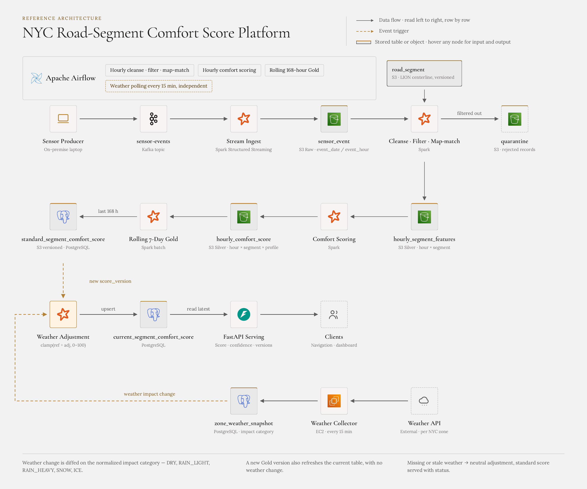

<h1>NYC Road Comfort Data Platform</h1>

<h3>조금 더 걸리더라도, 더 편안한 길을 선택할 수 있도록</h3>

  <strong>
    도로별 승차감 데이터를 구축해 내비게이션의 
    ‘편안한 경로 우선’ 기능을 가능하게 하는 데이터 플랫폼입니다
  </strong>

  <a href="http://43.203.192.129:8501/"><strong>대시보드 </strong></a>
  

---

## 1. 프로젝트 개요

### 누구의 문제를 해결하는가?

- 도로별 승차감 정보를 경로 추천에 활용하려는 **내비게이션 시스템 개발자**

### 어떤 문제인가?

- 기존 경로 추천은 시간·거리·비용 중심으로, **승차감 기준이 부족함**
- 도로 세그먼트별 승차감을 동일한 기준으로 비교할 데이터셋이 없음

### 어떻게 해결할 것인가?

실제 NYC 운행 기록과 도로 환경을 바탕으로 차량 주행 센서 데이터를 생성하고,
도로 세그먼트 × 차량 프로필별 **Comfort Score**를 제공합니다. 내비게이션이 전달한 여러 후보 경로의 점수를 계산해 가장 편안한 경로를
비교할 수 있게 합니다.

---

## 2. 데이터 파이프라인

단계 이름으로 클릭한 뒤 항목을 펼치면 Input 규모, 처리 내용, Output을 확인할 수 있습니다

<table align="center">
  <tr>
    <td align="center"><a href="#stage-source"><b>① Source</b></a> 원천·기준정보</td>
    <td>→</td>
    <td align="center"><a href="#stage-simulation"><b>② Simulation</b></a> 10Hz 주행 센서 데이터 생성</td>
    <td>→</td>
    <td align="center"><a href="#stage-bronze"><b>③ Bronze</b></a> Kafka → S3</td>
    <td>→</td>
    <td align="center"><a href="#stage-features"><b>④ Silver Features</b></a> cleaning·맵매칭</td>
  </tr>
  <tr>
    <td colspan="7" align="right">↓</td>
  </tr>
  <tr>
    <td align="center"><a href="#stage-serving"><b>⑧ Serving API</b></a> 후보 경로 평가</td>
    <td>←</td>
    <td align="center"><a href="#stage-current"><b>⑦ Current Gold</b></a> 현재 날씨 반영</td>
    <td>←</td>
    <td align="center"><a href="#stage-standard"><b>⑥ Standard Gold</b></a> 최근 168시간(1주일) 가중 평균</td>
    <td>←</td>
    <td align="center"><a href="#stage-hourly"><b>⑤ Hourly Score</b></a> 1시간 단위 방향별 점수</td>
  </tr>
</table>

<strong>전체 아키텍처 다이어그램 보기</strong>

## 3. 데이터 상세

<strong>① Source — 원천 데이터와 시뮬레이션 환경</strong>

| 구분 | 내용 |
| --- | --- |
| Input | TLC HVFHV 월간 Parquet, LION, Pavement Ratings, Speed Humps, Taxi Zone |
| 규모 | TLC 2024-02 **19,359,148행 / 441MB**, LION **166,222 segments**, Taxi Zone **263개** |
| 처리 | 원천 스냅샷과 checksum 보존 → 좌표계·geometry 표준화 → 노면·방지턱·zone을 LION segment에 공간 매핑 |
| Output | 버전형 <code>road_segment</code>, <code>enriched_segment_reference</code>, 시뮬레이션용 road environment |

<strong>② Simulation — TLC 운행을 10Hz 센서 이벤트로 재생</strong>

| 구분 | 내용 |
| --- | --- |
| Input | TLC 월간 trip, road environment, 차량 프로필 5종 |
| 규모 | 전체 trip을 request 시각·원천 row 순서로 batch fetch, 동시에 활성화되는 차량 수 제한 없음 |
| 처리 | Zone 안 승·하차 지점 선택 → LION 경로 계산 → 노면·방지턱·차량 반응을 반영해 속도·가속도·jerk·조향값 생성 |
| Output | Kafka <code>sensor-events</code> JSON, 순서·멱등 키 <code>(trip_id, trip_seq)</code> |

<strong>③ Bronze — Kafka 원본을 S3에 보존</strong>

| 구분 | 내용 |
| --- | --- |
| Input | Kafka key·value·topic·partition·offset·timestamp |
| 규모 | 1시간 실측 **12,058,018행 / 2.6GB / 3,545 files** |
| 처리 | Structured Streaming checkpoint로 offset 복구, <code>_ingested_at</code> 추가, event time 기준 파티셔닝 |
| Output | S3 <code>bronze/sensor-events/event_date=YYYY-MM-DD/hour=HH</code> Parquet |

<strong>④ Silver Features — 정제·중복 제거·GPS 맵매칭</strong>

| 구분 | 내용 |
| --- | --- |
| Input | 대상 시간 Bronze와 인접 경계 이벤트, 버전 고정 LION geometry |
| 규모 | 약 1,205만 센서 이벤트/시간 |
| 처리 | 계약·범위 검증 → <code>(trip_id, trip_seq)</code> 중복 제거 → GPS·heading 기반 LION 맵매칭 → RMS·P95·급가감속·조향 특징 집계 |
| Output | <code>hourly_segment_features</code> **38,049행**, 실패 원문과 사유를 담은 quarantine |

<strong>⑤ Hourly Score — 수직·종·횡 승차감 계산</strong>

| 구분 | 내용 |
| --- | --- |
| Input | 시간 × segment × 차량 프로필별 features **38,049행** |
| 규모 | Bronze 대비 약 **317:1 축약** |
| 처리 | 가속도·jerk·조향 특징을 수직·종·횡 0~100 점수로 변환 |
| Output | <code>hourly_comfort_score</code> **38,049행**, 표본 수·trip 수·산식 버전 |

<strong>⑥ Standard Gold — 최근 168시간 기준 점수</strong>

| 구분 | 내용 |
| --- | --- |
| Input | 최근 168시간 Hourly Score, 전체 segment와 차량 프로필 universe |
| 규모 | full-NYC 기준 실행당 최대 **997,332행**¹ |
| 처리 | 최소 통행량 필터 → 방향별 평균 → 표본 부족 구간을 모집단 평균으로 shrinkage → 신뢰도 계산 |
| Output | 버전형 S3 snapshot과 PostgreSQL <code>standard_segment_comfort_score</code> |

¹ 166,222 segments × 차량 프로필 5종 및 차량 무관 대표 프로필 1종

<strong>⑦ Current Gold — 최신 날씨 반영</strong>

| 구분 | 내용 |
| --- | --- |
| Input | 최신 Standard Score, 최대 263개 zone의 Open-Meteo 날씨 |
| 규모 | 날씨는 15분마다 수집하며 영향 등급이 바뀐 zone만 재계산 |
| 처리 | 비·눈·결빙·강풍·저시야 영향을 방향별 점수에 적용, 오류 행은 quarantine |
| Output | PostgreSQL <code>current_segment_comfort_score</code> 최신 행 |

<strong>⑧ Serving API — 최종 Comfort Score 제공</strong>

| 구분 | 내용 |
| --- | --- |
| Input | 차량 프로필과 여러 후보 경로의 LION segment 목록 |
| 규모 | 후보 경로 전체 segment를 PostgreSQL에서 한 번에 조회 |
| 처리 | Current 우선·Standard fallback → 경로 평균과 취약 구간 점수 결합 → 점수순 정렬 |
| Output | 경로별 Comfort Score·신뢰도·버전과 <code>recommended_route_id</code> |

---

## 4. 기술적 고민과 결정

고민을 클릭하면 측정값·기각한 대안·검증 기준을 담은 상세 페이지로 이동합니다

| 고민 | 결정 |
| --- | --- |
| **[Spark 배치를 어디서 실행할까 →](docs/decisions/01-spark-execution-environment.md)** | 부트스트랩 5~10분이 연산 시간보다 긴 워크로드라 **EMR Serverless** 선택. |
| **[Bronze에 소파일이 쌓인다 →](docs/decisions/02-bronze-small-files.md)** | 트리거 기준을 시간에서 **오프셋**으로 전환. 1시간 **3,545개 → 20개 이하** |
| **[매시간 Bronze 전체를 스캔한다 →](docs/decisions/03-bronze-partition-pruning.md)** | 쓰기 측 파티션에 맞춰 읽기 프루닝. parquet scan **3회 → 1회** |
| **[갱신 주기가 다른 데이터를 어떻게 묶을까 →](docs/decisions/05-pipeline-split-and-assets.md)** | 168시간 집계와 15분 보정을 **3개 DAG로 분리**하고 Airflow Asset으로 연결 |
| **[품질 검증 실패를 어떻게 처리할까 →](docs/decisions/06-row-quarantine-and-circuit-breaker.md)** | 행 단위 **quarantine** + 실패율 **circuit breaker**. 정상 행은 계속 서빙 |
| **[중간 산출물을 저장해야 할까 →](docs/decisions/07-in-memory-intermediate.md)** | T1·T2를 같은 Spark session으로 연결해 S3 write/read 제거 |
| **[날씨를 이력으로 쌓아야 할까 →](docs/decisions/08-latest-zone-weather.md)** | 15분 스냅샷 누적을 **존별 최신 1건**으로 재설계, 적용 시각만 점수에 고정 |

  <a href="docs/decisions/"><strong>의사결정 기록 템플릿과 전체 목록</strong></a>
  &nbsp;·&nbsp;
  <a href="docs/adr/"><strong>ADR</strong></a>

---

## 5. 팀원

<table align="center">
  <tr>
    <td align="center" width="180">
      <a href="https://github.com/Kijoonj">
         
        <strong>정기준</strong>
      </a> 
      <a href="https://github.com/Kijoonj">@Kijoonj</a>
    </td>
    <td align="center" width="180">
      <a href="https://github.com/codrae">
         
        <strong>김용진</strong>
      </a> 
      <a href="https://github.com/codrae">@codrae</a>
    </td>
    <td align="center" width="180">
      <a href="https://github.com/jiyoon-ryu">
         
        <strong>류지윤</strong>
      </a> 
      <a href="https://github.com/jiyoon-ryu">@jiyoon-ryu</a>
    </td>
    <td align="center" width="180">
      <a href="https://github.com/Lmmhhhh">
         
        <strong>이민하</strong>
      </a> 
      <a href="https://github.com/Lmmhhhh">@Lmmhhhh</a>
    </td>
  </tr>
  <tr>
    <td align="center">Data Engineer</td>
    <td align="center">Data Engineer</td>
    <td align="center">Data Engineer</td>
    <td align="center">Data Engineer</td>
  </tr>
</table>

  소프티어 부트캠프 8기 · Data Engineering 트랙 4팀(4una)

