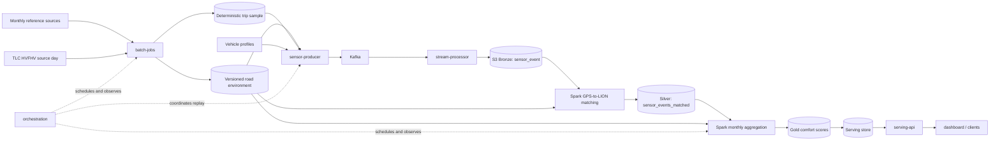
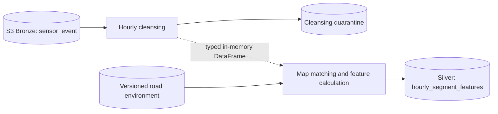
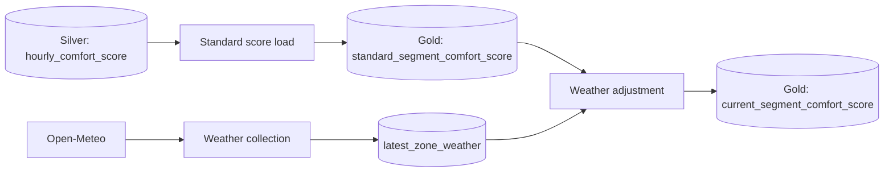

# Target Architecture

## Current repository state

The repository contains Python 3.12 `uv` workspace members for the shared
library and seven services. Implementation is incremental rather than
skeleton-only: `services/batch-jobs` currently provides reference-environment,
sensor-cleansing and hourly-feature processing in one Spark execution,
hourly-scoring, Gold-publication, and database-migration commands. Its
importable modules, default YAML configuration, and SQL migrations are packaged
under the single `batch_jobs` namespace.

The data flow below reflects the target architecture as decided in
[ADR-0003](../docs/adr/0003-gold-publication-owned-by-batch-jobs.md): Gold
score publication and serving-database migrations remain owned by
`services/batch-jobs`. `services/gold-loader` has been removed; it no longer
exists as a workspace member.

## Target local-first flow

## Architectural principles

- **Determinism:** source snapshots, configuration, seeds, and algorithm versions
  must be recorded with every run.
- **Stable road identity:** the LION `SegmentID` is canonical from Silver map
  matching through aggregation, storage, and the API. Bronze sensor events retain
  only GPS coordinates.
- **Raw-data retention:** retain raw simulated measurements so scoring algorithms
  can be changed without repeating the wall-clock replay.
- **Contract ownership:** shared records and cross-service identifiers belong in
  `libs/de4-core`.
- **Local-first boundaries:** use interfaces that can map to managed AWS services,
  without requiring AWS for development.
- **Observable runs:** every dataset and score should include a run ID, source
  period, creation time, and contract or algorithm version.

## Logical data layers

| Layer | Content | Mutation policy |
| --- | --- | --- |
| Source snapshot | Unmodified downloaded source files and metadata | Immutable |
| Raw/bronze | Kafka simulation events persisted to S3 as received | Append-only |
| Validated/silver | One retained row per Bronze event with GPS-to-LION match and versioned event flags | Rebuildable |
| Gold | Monthly road segment x vehicle-type comfort score | Versioned replacement |
| Serving | Latest and optionally historical gold records | Loaded idempotently |

S3 is the target Bronze store. The file/table format, local development access
pattern, serving database, and remaining AWS service mapping are open decisions.
They should be recorded in ADRs rather than assumed from this diagram.

## Important boundaries

### Monthly environment build

Reference sources are normalized into a versioned, routable segment network.
Spatial joins attach pavement and speed-hump attributes to the canonical segment.
Taxi-zone geometry is retained to choose valid deterministic endpoints.

### Wall-clock replay

The producer reads the pinned trip sample and road environment, chooses or loads
a vehicle profile, computes a route, and emits time-ordered observations. It must
be restartable without producing logically different events.

### Stream collection

Kafka decouples replay from persistence. The stream processor validates shared
contracts, handles duplicates according to the accepted idempotency key, and
writes raw events to S3 without discarding variables that may be useful to later
scoring experiments.

### Hourly cleansing-to-feature execution

The implemented local hourly batch path uses one Spark application boundary for
cleansing and feature calculation:

T1 reads every Bronze hour touched by T2's lookback and lookahead window,
validates and deduplicates each hour, and passes accepted rows directly to T2 in
the same Spark session. There is no persisted `processed_sensor_event` boundary.
Only the target-hour quarantine and `hourly_segment_features` are stored. The
Airflow DAG invokes the combined command once in its `sensor_processing`
TaskGroup, then continues to scoring and publication.

The same DAG then loads `standard_segment_comfort_score` and refreshes every
`current_segment_comfort_score` row, while a separate 15-minute DAG collects
Open-Meteo weather into `latest_zone_weather` and refreshes only the segments in
zones whose weather actually changed (issues #207, #216, #217):

Weather collection and the weather adjustment need no Spark, so both run as
Python tasks inside the Airflow scheduler rather than as separate containers.

### Silver map matching

Spark preserves a one-to-one Bronze-to-Silver row relationship while matching
GPS coordinates against a pinned LION snapshot. Match status and diagnostic
fields are retained even when `segment_id` is null. Threshold-derived braking,
acceleration, and discomfort flags first appear here with `scoring_version`.

### Monthly score publication

A Spark job derives stable features and a versioned score. Publication must be
atomic at the score-period level so the API never serves a partially loaded
monthly result.
