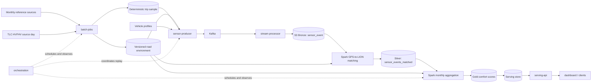
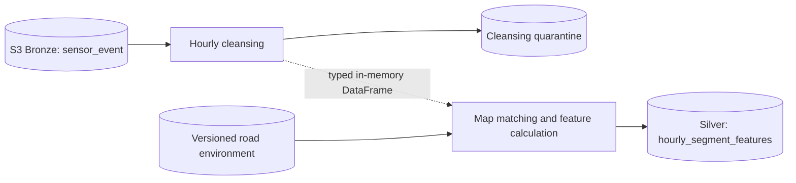
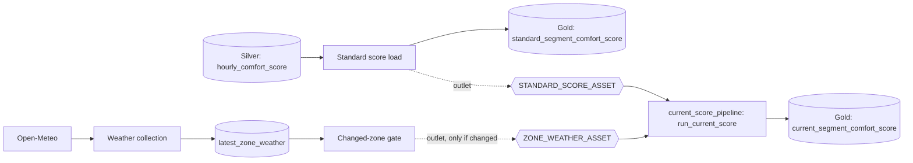

# Target Architecture

## Current repository state

The repository contains Python 3.12 `uv` workspace members for the shared
library and seven services. Implementation is incremental rather than
skeleton-only: `services/batch-jobs` currently provides reference-environment,
sensor-cleansing and hourly-feature processing in one Spark execution,
hourly-scoring, Gold-publication, and database-migration commands. Its
importable modules, default YAML configuration, and SQL migrations are packaged
under the single `batch_jobs` namespace.

The data flow below reflects the target architecture as decided in
[ADR-0003](../docs/adr/0003-gold-publication-owned-by-batch-jobs.md): Gold
score publication and serving-database migrations remain owned by
`services/batch-jobs`. `services/gold-loader` has been removed; it no longer
exists as a workspace member.

## Target local-first flow

## Architectural principles

- **Determinism:** source snapshots, configuration, seeds, and algorithm versions
  must be recorded with every run.
- **Stable road identity:** the LION `SegmentID` is canonical from Silver map
  matching through aggregation, storage, and the API. Bronze sensor events retain
  only GPS coordinates.
- **Raw-data retention:** retain raw simulated measurements so scoring algorithms
  can be changed without repeating the wall-clock replay.
- **Contract ownership:** shared records and cross-service identifiers belong in
  `libs/de4-core`.
- **Local-first boundaries:** use interfaces that can map to managed AWS services,
  without requiring AWS for development.
- **Observable runs:** every dataset and score should include a run ID, source
  period, creation time, and contract or algorithm version.

## Logical data layers

| Layer | Content | Mutation policy |
| --- | --- | --- |
| Source snapshot | Unmodified downloaded source files and metadata | Immutable |
| Raw/bronze | Kafka simulation events persisted to S3 as received | Append-only |
| Validated/silver | One retained row per Bronze event with GPS-to-LION match and versioned event flags | Rebuildable |
| Gold | Monthly road segment x vehicle-type comfort score | Versioned replacement |
| Serving | Latest and optionally historical gold records | Loaded idempotently |

S3 is the target Bronze store. The file/table format, local development access
pattern, serving database, and remaining AWS service mapping are open decisions.
They should be recorded in ADRs rather than assumed from this diagram.

## Important boundaries

### Monthly environment build

Reference sources are normalized into a versioned, routable segment network.
Spatial joins attach pavement and speed-hump attributes to the canonical segment.
Taxi-zone geometry is retained to choose valid deterministic endpoints.

### Wall-clock replay

The producer reads the pinned trip sample and road environment, chooses or loads
a vehicle profile, computes a route, and emits time-ordered observations. It must
be restartable without producing logically different events.

The EC2 runtime can resolve the active S3 environment pointer or an immutable
manifest and verifies its prepared road and taxi-zone artifacts before routing.
The bounded TLC input remains local until the separate S3 trip-reader work lands.

### Stream collection

Kafka decouples replay from persistence. The stream processor validates shared
contracts, handles duplicates according to the accepted idempotency key, and
writes raw events to S3 without discarding variables that may be useful to later
scoring experiments.

### Hourly cleansing-to-feature execution

The implemented local hourly batch path uses one Spark application boundary for
cleansing and feature calculation:

T1 reads every Bronze hour touched by T2's lookback and lookahead window,
validates and deduplicates each hour, and passes accepted rows directly to T2 in
the same Spark session. There is no persisted `processed_sensor_event` boundary.
Only the target-hour quarantine and `hourly_segment_features` are stored. The
Airflow DAG invokes the combined command once in its `sensor_processing`
TaskGroup, then continues to scoring and publication.

`standard_score_pipeline`(renamed from `hourly_pipeline`, issue #229) loads
`standard_segment_comfort_score` from `hourly_comfort_score` and stops there — it
does not write `current_segment_comfort_score`. A separate 15-minute
`zone_weather_pipeline` (renamed from `weather_pipeline`, issue #230) collects
Open-Meteo weather into `latest_zone_weather` and, when its changed-zone gate
(reusing `find_changed_zones()`) finds zones whose weather actually changed,
publishes `ZONE_WEATHER_ASSET` (issues #207, #216, #230).

Writing `current_segment_comfort_score` from two independently scheduled DAGs
was a known race (issue #228) — `zone_weather_pipeline`'s changed-zone read
could race a full standard-driven refresh, letting a stale weather snapshot
overwrite a fresher one. ADR-0007 (accepted) moves that write into a single
DAG, `current_score_pipeline` (issue #231), scheduled by
`AssetAny(STANDARD_SCORE_ASSET, ZONE_WEATHER_ASSET)` so either producer DAG
wakes it, with `max_active_runs=1` serializing writes. It inspects
`context["triggering_asset_events"]` to pick the recompute mode: a full
refresh when `STANDARD_SCORE_ASSET` triggered, changed-zones-only when only
`ZONE_WEATHER_ASSET` did:

Weather collection and the changed-zone gate need no Spark, so both run as
Python tasks inside the Airflow scheduler rather than as separate containers —
`current_score_pipeline`'s single task does too.

### Silver map matching

Spark preserves a one-to-one Bronze-to-Silver row relationship while matching
GPS coordinates against a pinned LION snapshot. Match status and diagnostic
fields are retained even when `segment_id` is null. Threshold-derived braking,
acceleration, and discomfort flags first appear here with `scoring_version`.

### Monthly score publication

A Spark job derives stable features and a versioned score. Publication must be
atomic at the score-period level so the API never serves a partially loaded
monthly result.

### Bronze compaction

Bronze `zone_weather_snapshot` accumulates small files from its 15-minute writer. An
independent, low-frequency `bronze_compaction` DAG (no outlets, does not block or gate
other DAGs) merges same-partition objects once they are old enough that no further
writes are expected, verifying row counts before discarding the originals.
`sensor-events` was dropped from this DAG's scope after discovering that in-place
compaction of a Structured Streaming FileStreamSink directory is unsafe (the sink's
`_spark_metadata/` commit log would go stale); its backlog cleanup is deferred to a
follow-up issue. See [ADR-0009](../docs/adr/0009-bronze-compaction-dag.md).

### Operational monitoring

Project EC2 (running the deployed services) and Monitoring EC2 are separate AWS
instances in the same VPC. `infra/compose/exporters.yaml` runs `node_exporter`
(`:9100`) and cAdvisor (`:8081`) on Project EC2; `infra/compose/monitoring.yaml`
runs Prometheus and Grafana (`:3000`) on Monitoring EC2. Prometheus resolves the
`project-ec2` hostname to Project EC2's private IP through Docker `extra_hosts`,
sourced from `infra/monitoring/.env` (`PROJECT_EC2_PRIVATE_IP`) — no AWS IP is
hardcoded in tracked files, and Prometheus itself is bound to `127.0.0.1` on
Monitoring EC2 rather than exposed publicly. See
[ADR-0010](../docs/adr/0010-split-project-and-monitoring-ec2-for-prometheus-grafana.md)
and [infra/monitoring/README.md](../infra/monitoring/README.md) for the full
setup and validation steps.

AWS Security Group provisioning for the two EC2s stays outside this repository's
code (`terraform/envs/` is currently empty) — it is a manual prerequisite
documented in `infra/monitoring/README.md`, not something this diagram or
ADR-0010 settles.

Grafana auto-provisions four dashboards from the same `Infrastructure`
provider (file-based, reads every JSON under
`infra/monitoring/grafana/dashboards/`): `Project Infrastructure`
(`project-infrastructure.json`, Project EC2 host metrics from `node_exporter`
and per-container metrics from cAdvisor), `Serving API`
(`serving-api.json`, HTTP request rate/status/latency from
`serving_api.metrics` — a dedicated metrics port, `SERVING_API_METRICS_PORT`
default `9101`, separate from the API port so `/metrics` never joins the
public API surface), `Kafka` (`kafka.json`, broker/topic/consumer-group
metrics from a `danielqsj/kafka-exporter` sidecar reading the broker's
`localhost:9092`), and `Airflow` (`airflow.json`, scheduler/dag-processor
heartbeats, task and DAG-run state and duration). Every dashboard JSON is the
source of truth (`allowUiUpdates: false` in `dashboards.yml`); manual Grafana
UI edits are not persisted.

Kafka is an EC2-hosted infrastructure service managed from
`infra/compose/kafka.yaml`. Automatic CD reconciles that Compose definition and
the `sensor-events` topic, while Sensor Producer replay runs locally rather than
being deployed on every repository update. The local producer connects through
the broker's external listener on port 9094. The listener is PLAINTEXT in the
PoC, so its Security Group rule must be restricted to the producer host's public
IP.

Kafka clients that run as separate Project EC2 containers — `stream-processor`
and `kafka-exporter` — use `network_mode: host` and connect to the internal
listener at `localhost:9092` rather than a compose network hostname like
`kafka:9092`. On the default bridge network, a client container's own
`localhost` refers to itself, not the sibling `kafka` container, so a
same-network hostname connection fails past the initial bootstrap request.

Airflow does not expose `/metrics` itself. `infra/compose/airflow.yaml` adds
an `airflow-statsd-exporter` sidecar (`prom/statsd-exporter`) on the same
`de4-local` compose network as the Airflow components — no host-networking
workaround is needed here, since StatsD is a one-way UDP send from Airflow to
the exporter's service-name hostname, not a request/response protocol where
the broker's self-reported address matters. Airflow is configured for
DogStatsD-tagged StatsD (`statsd_datadog_enabled`) so `dag_id`/`task_id`
survive as Prometheus labels instead of being baked into legacy dotted metric
names; that code path needs the separate `datadog` PyPI package (not the
`apache-airflow[statsd]` extra's `statsd` package), installed via
`_PIP_ADDITIONAL_REQUIREMENTS` like the service's other non-image
dependencies. A small `statsd_exporter` mapping
(`infra/monitoring/statsd/airflow-mapping.yml`) converts exactly the three
Airflow timer metrics the dashboard uses into Prometheus histograms, because
the exporter's default (a fixed-quantile Summary) can't produce a p95.

Alerting and metrics for the remaining services (Spark) remain outside this
scope.
